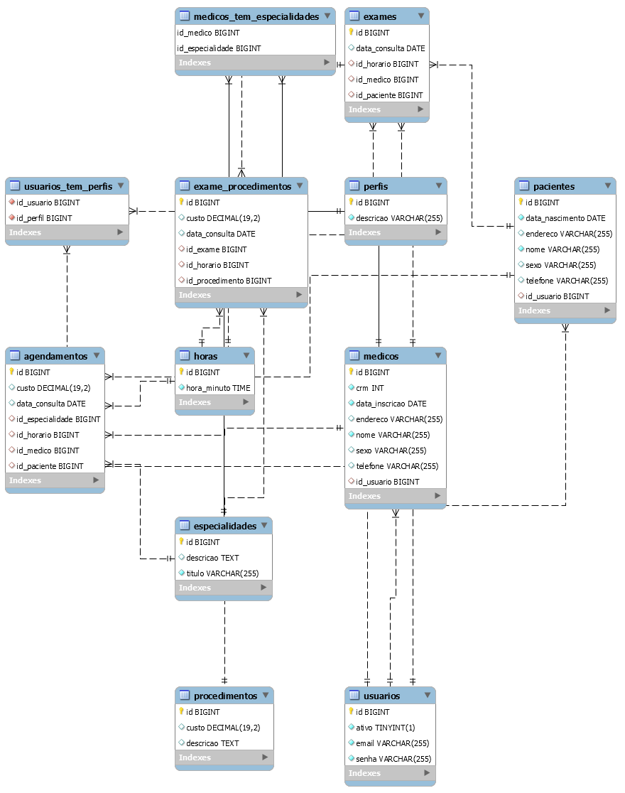

# Autores

Lyndon / Isa

# controle-hospitalar

Turma: Terceiro Período de Análise e Desenvolvimento de Sistemas - UNIAMÉRICA
Professor: Lucas Guilherme Hübner

Sistema para controlar Faturamento Hospitalar: Guia de Consulta, Exame e Consulta
do Prontuário:

# Diagramas

https://www.cin.ufpe.br/~gta/rup-vc/extend.bus_model/guidances/guidelines/diagrams_in_the_business_analysis_model_F0F7B759.html

## Diagrama de Classes de Negócio

* https://docente.ifrn.edu.br/givanaldorocha/disciplinas/engenharia-de-software-licenciatura-em-informatica/diagrama-de-classes
* https://lucid.app/lucidchart/

## Modelo Entidade Relacionamento

# Tecnologias

Tecnologias que devem ser utilizadas para desenvolver este sistema:

## REACT

* https://www.youtube.com/watch?v=2xoJjEgecZM
* https://www.youtube.com/watch?v=EiZbhsVY2Dk&list=PLwgL9IEA0PxUjbhob9UMdpVq12sGrjgU6
* https://www.youtube.com/watch?v=i6Oi-YtXnAU
* https://www.youtube.com/watch?v=0k3czp6O-qg&list=PLXe1Uv1JGlTbrdrcZIZOabEBSpeNeVHD7
* https://jsonplaceholder.typicode.com/

## JWT

https://www.youtube.com/watch?v=HsSXh2kkMVw

## Banco de dados Relacional (MySQL)

https://www.youtube.com/watch?v=Ofktsne-utM&list=PLHz_AreHm4dkBs-795Dsgvau_ekxg8g1r

## Linguagem de programação orientada a objetos (Java)

* https://www.youtube.com/watch?v=LnORjqZUMIQ
* https://github.com/in28minutes/java-tutorial-for-beginners
* https://www.arquivodecodigos.com.br/dicas_truques_categoria2.php?linguagem=2&categoria1=41&categoria2=80

## Framework para linguagem (Spring Boot)

http://start.spring.io/

# pré-requisito

* NodeJS (https://nodejs.org/dist/v14.15.4/node-v14.15.4-x64.msi)
* Java (https://builds.openlogic.com/downloadJDK/openlogic-openjdk/11.0.8%2B10/openlogic-openjdk-11.0.8%2B10-windows-x64.msi)
* MySQL (https://downloads.mysql.com/archives/installer/)

# Visual Code Extensions

* ERD Editor (https://marketplace.visualstudio.com/items?itemName=dineug.vuerd-vscode)
* Spring Boot Tools (https://marketplace.visualstudio.com/items?itemName=Pivotal.vscode-spring-boot)
* Spring Boot Dashboard (https://marketplace.visualstudio.com/items?itemName=vscjava.vscode-spring-boot-dashboard)
* Language Support for Java(TM) by Red Hat (https://marketplace.visualstudio.com/items?itemName=redhat.java)
* https://marketplace.visualstudio.com/items?itemName=formulahendry.code-runner

# Swagger

http://localhost:3000/swagger-ui.html

# Princípios

https://medium.com/desenvolvendo-com-paixao/o-que-%C3%A9-solid-o-guia-completo-para-voc%C3%AA-entender-os-5-princ%C3%ADpios-da-poo-2b937b3fc530

# ides online

https://repl.it/@lyndontavares/AnotherStaticControlflowgraph#Main.java
https://www.jetbrains.com/pt-br/idea/
https://www.arquivodecodigos.com.br/dicas_truques_categoria2.php?linguagem=2&categoria1=41&categoria2=80
https://developer.ibm.com/br/tutorials/j-introtojava1/

# Trainning

https://reactrouter.com/web/guides/quick-start

# Java

https://www.youtube.com/watch?v=8Tn3bYOUAfQ&list=PLA8Qj9w4RGkVOj-xGYJCHJ0Ob4CMg-8NI&index=1

# motivação

https://www.youtube.com/watch?v=zeuqH8crrP0
